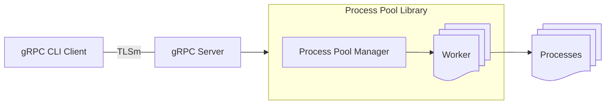

# Programming Exercise Design

## 1 Introduction

This design document will outline the design for a response to this
programming challenge. [Design Challenge Windows](https://github.com/gravitational/careers/blob/main/challenges/systems/challenge-1-windows.md)
The intent of which is to create a library that delivers process execution and monitoring, along with a gRPC server and cli client for
exercising the server which makes use of the library. The client and server need to support TLSm authentication along with
streaming output support for running processes. 

## 2 Overall Design/Flow


## 3 Details

### 3.1 Process Pool Library

This stand alone library will be used by the gRPC server to launch and control proccesses. It is made up of two parts the Worker and Process Pool Manager.

#### Worker

This is responsible for launching and managing a single process. The worker will encapsulate the items needed to start, track, and manage window proccesses.

A process under the worker will have the following status.

```rust
pub enum WorkerStatus {
    NotStarted,
    FailedToStart,
    Running,
    Stopped,
}
```

It will have the following public interface.

```rust
pub fn start(&mut self, command: &str) -> Result<u64>
pub fn stop(&mut self) -> Result<()>
pub fn get_output_slice(&mut self) -> Result<String> // this will change.
pub fn get_status_string(&self) -> String
pub fn get_status(&self) -> WorkerStatus
pub fn get_id(&self) -> u64
pub fn wait(&mut self)
```
| API | Description |
| ---------- | ----------------------------------------------------------- |
| start | Launches a process with the given command. The process can have various machine properties throttled using environment variables (see below). Returns the new worker id.
| stop | Given a process id and the process is still running, this command will stop the process and change its status to Stopped. Returns true or false if the process was succesfully stopped.|
| output | |
| get_status_string | Returns the current WorkerStatus as a string. |
| get_status | Returns the current WorkerStatus. |
| get_id | Returns the internal worker id, generally used as the process id. |
| wait | Wait for the specified process to complete. This is mainly used for testing. Though its made public as it might be usefule for users |

When starting a new process it is possible to throttle various elements of the process by setting the following environment variables.

| Env Variable | Usage |
| ---------------- | ------------------------------------------------ |
| PM_PROCESS_CPU_LIMIT | A number representing a percentage of CPU to throttle the process to. |
| PM_PROCESS_MEMORY_LIMIT | A number in bytes to cap the processes use of memory to. 
| PM_PROCESS_IO_LIMIT | A number in bytes to cap the IO usage of the process to.

> A  note about worker id. It is an auto generated number which grows for each process created using the start command. We "could" use the process id contained in the PROCESSINFORMATION windows struct, but this is simpler and easier for users to understand.

#### Process Pool Manager

This is responsible for creating and managing a pool of worker objects. It will have the following public interface. The set of workers will be stored in a HashMap for simple retrieval based on worker id. 

```rust
pub fn start_process(&mut self, command_line: &str) -> Result<(u64)>
pub fn stop_process(&mut self, process_id: u64) -> Result<bool>
pub fn query_process_status(&self, process_id: u64) -> String
pub fn get_process_output_stream(&mut self, process_id: u64) -> Result<String>
pub fn list_process_ids(&self) -> Vec<u64>
```
| API | Description |
| ---------- | ----------------------------------------------------------- |
| start_process | Creates a new worker and calls its start method passing the given command string. Retains the worker in its internal HashMap. Returns the worker id from the worker start command. |
| stop_process | Locate the worker with the given id and call its stop method. Returns the result of the worker stop command. This will also remove the worker from the pool |
| query_process_status | Get the status of the worker based on the provided worker id. Returns the string result of calling the worker get_status_string method.
| get_process_output_stream | Returns a string representing the entirety of output to date from the process. |
| list_process_ids | Returns a vector of currently encapsulated workers. |

All API's that take a process id will error if that process id cannot be found, likely due to stop being called.

### 3.2 gRPC General

The gRPC service will be defined by the following protobuf outline. A protobuf compiler will need to be present when building this codebase. It should have its path defined under the PROTOC environment variable. The compiler can be found [here](https://github.com/protocolbuffers/protobuf/releases). 

```
message Command {
  string command = 1;
}

message StartedProcess {
  ProcessId process_id = 1;
}

message StoppedProcess {
  bool process_stopped = 1;
}

message OutputStreamResponse {
  string stdout = 1;
}

message ProcessId {
  uint64 id = 1;
}

message ProcessList {
  repeated uint64 processes = 1;
}

message ProcessStatus {
  string status = 1;
}

service ProcessApiService {
  rpc Start (Command) returns (StartedProcess);
  rpc Stop (ProcessId) returns (StoppedProcess);
  rpc List (google.protobuf.Empty) returns (ProcessList);
  rpc Status(ProcessId) returns (ProcessStatus);
  rpc Output (ProcessId) returns (stream OutputStreamResponse);
}
```

### 3.2 gRPC Server

A gRPC server that uses TLSm for authentication. It supports the following API. It will have ownership of a single Process Pool Manager for acting on these commands.

> The connection port will be hard coded for now. 

```rust
async fn start(&self, request: Request<Command>) -> Result<Response<StartedProcess>, Status>
async fn stop(&self, request: Request<ProcessId>) -> Result<Response<StoppedProcess>, Status>
async fn list(&self, _request: Request<()>) -> Result<Response<ProcessList>, Status>
async fn status(&self, request: Request<ProcessId>) -> Result<Response<ProcessStatus>, Status> 
async fn output(&self, request: Request<ProcessId>) -> Result<Response<Self::OutputStream>, Status>
```

### 3.3 gRPC CLI Client

A CLI that connects to the gRPC server. It will have the following interface. 

| Sub Command | Arguments |
| ----------------- | ----------------------------------------------- |
| start | -c COMMAND_STRING |
| stop | -p PROCESS_ID |
| status | -p PROCESS_ID |
| output | -p PROCESS_ID |
| list | _none_ |

Internally it will then make the calls to the server for the given command. Outputing any response as required.

While the other commands will end after completion. The output command continues until the process ends or the user aborts the CLI command. This is due to the streaming nature of the command.

> NOTE Most likely need to support multiple instances of the CLI as should be usable if an instance is running Output.

## 4 Crates

| Crate | Usage |
| -------------- | --------------------------------------------------- |
| windows | Exposes a large set of Windows API's. Primarily used for process creation and configuration. |
| tokio | Used for basic async support |
| tokio-stream | Used to support async streaming for the process output |
| tonic | Used for gRPC also supports TLS connecting. |
| prost | Required for tonic protobuf support. |
| anyhow | Ease of use for returning Results. |
| clap | Used for command line processing in the cli |

## 5 TLSm Certificates and Authentication

> Note: These certs did not work. Error returned when trying to connect to server was
> `Error: tonic::transport::Error(Transport, ConnectError(Custom { kind: InvalidData, error: InvalidCertificate(NotValidForName) }))`

Certs will be stored and retieved locally for simplicity. Having their paths hardcoded relative to the exe. If a config system is implemented their paths could be placed in the config. 

#### Install OpenSSL for Windows

The installers can be found [here](https://slproweb.com/products/Win32OpenSSL.html)

#### Set the location of the cfg file
`set OPENSSL_CONF=C:\Program Files\OpenSSL-Win64\bin\openssl.cfg`

#### Generate the Certificate Authority key file
`openssl genrsa -out ca.key 2048`

#### Generate the Certificate Authority pem file.
`openssl req -x509 -new -nodes -key ca.key -sha256 -days 3650 -out ca.pem -subj "/CN=TeleportApi"`
- For now use a long lifespan for the cert

#### Generat the server key file
`openssl genrsa -out server.key 2048`

#### Generate the server csr file for use in creating the server.pem file
`openssl req -new -key server.key -out server.csr -subj "/CN=localhost"`

#### Generate the server pem file
`openssl x509 -req -in server.csr -CA ca.pem -CAkey ca.key -CAcreateserial -out server.pem -days 365 -sha256`

####Generat the client key file
`openssl genrsa -out client.key 2048`

#### Generate the client csr for use in creating the client pem file.
`openssl req -new -key client.key -out client.csr -subj "/CN=client"`

#### Generate the client pem file
`openssl x509 -req -in client.csr -signkey client.key -out client.pem -days 365 -sha256`

#### Generate the client ca pem file
`openssl x509 -req -in client.csr -CA ca.pem -CAkey ca.key -CAcreateserial -out client_ca.pem -days 365 -sha256`

- Unclear if this is really needed. There are other samples where this is not used.

TLS will be configures through `tonic` using the `tls_config` method on the `builder` for the Server and the same method on the `channel` object for the client.

## 6 Testing

Testing will be done using the standard Rust test framework. Testing of the library will focus on testing the Worker object. Both possitive and negative testing. 

Testing the gRPC server requires a mock client. Postive and Negative testing will be done. 

Testing of the CLI/gRPC client will require a mock server. Postive and Negative testing will be done.

Functional testing will also be done by hand.

> NOTE Testing may require a test application that can take a timeout interval and outputs information until the timeout completes.For now process commands will use a set of ping statements. These take time to execute and can be set using the -n argument to send multiple ping requests.